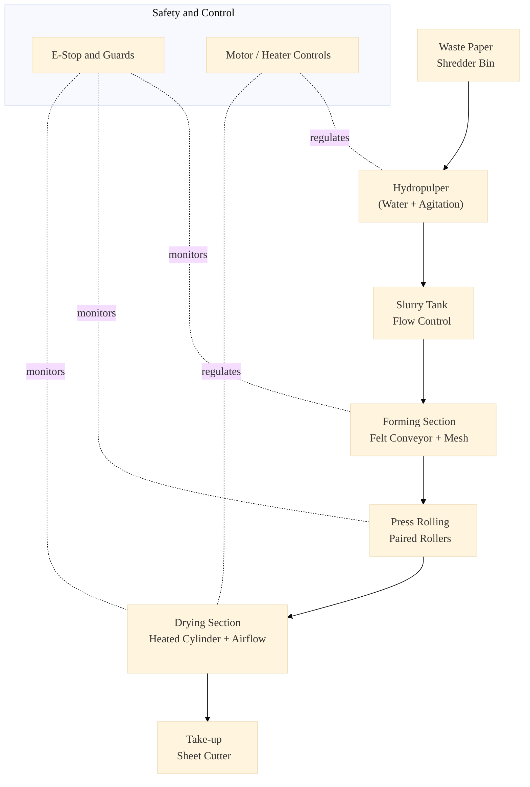
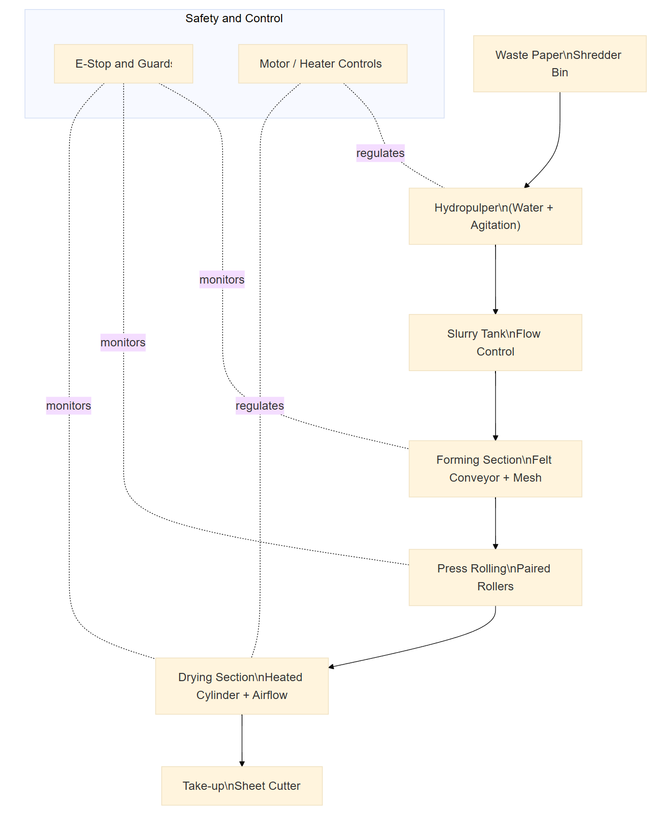
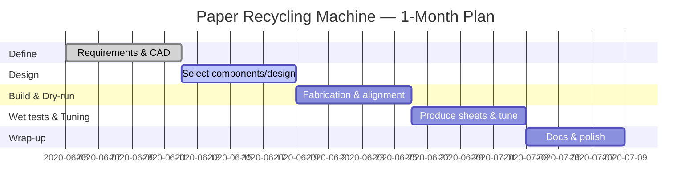

# Paper Recycling Machine — Final Year Project (BE Mechanical)

**Author:** Akash P Raj (USN: 4SN16ME012)  
**Guide:** Prof. Gangadhara Rao, Associate Professor, SIT Mangaluru  
**Duration:** 5 June – 8 July 2020 (≈ 1 month)

> **Provenance & Ethics:** This repository transparently reconstructs my BE final-year project. Content, steps and figures are derived from my original VTU/SIT report; some artefacts are recreated for portfolio clarity. No confidential data is included. :contentReference[oaicite:0]{index=0}
Commit message:

---

## 📖 Project Overview

A compact, low-cost **paper recycling machine** that integrates **pulping → forming → press rolling → drying** into a single bench-scale line. It’s designed for **schools, colleges, offices, and small units** where a full-scale mill isn’t viable, prioritising **safety, footprint, and ease of operation**.

**Why this matters**
- Diverts paper waste from bins; demonstrates **closed-loop recycling** on-site.
- Converts mixed office waste into **usable A5/A4 craft sheets** for teaching or prototyping.
- Shows practical integration of **mechanical design, fluid handling, heat transfer, and controls**.

**Scope & objectives**
- Build an integrated prototype with **continuous conveyor forming** and **heated drying**.
- Achieve **stable sheet formation**, reduce moisture via **press rolling**, and **dry to handle** state.
- Emphasise **operator safety** (guards, e-stop, thermal caution) and **simple maintenance** (belt tensioning, cleaning SOP).

**Out of scope**
- Industrial-grade calendaring/sizing, high-speed web control, or commercial grammage certification (the unit is for **demonstration and training**).

---

## ⚙️ Process Flow

1. **Pulping** → Shredded waste paper + water in a **hydropulper** to create slurry (target consistency ~2–3%).  
2. **Forming** → Slurry is deposited onto a **moving felt conveyor**; water drains by gravity/mesh to form a wet mat.  
3. **Press Rolling** → **Paired rollers** squeeze the web to expel free water and improve fibre bonding.  
4. **Drying** → **Heated cylinder** with assisted airflow dries the sheet to a handleable moisture level.

  
PNG fallback for printing / mobile

  

---

## 🔩 Major Components

| Subsystem | Key parts & specs | Purpose | Notes |
|---|---|---|---|
| **Feed & Pulping** | Hopper; **Hydropulper** vessel; Agitator/impeller | Convert shredded waste paper to slurry at ~2–3% consistency | Vessel & impeller sized for stable vortex without air entrainment |
| **Prime mover & Drive** | **AC motor 1 HP, 3-phase**; **Gearbox 42:1**; Pulley–belt | Provide low-speed, high-torque drive for rollers/conveyor | Guarded belts; align for minimal run-out |
| **Frame & Supports** | MS frame; housings; bearings | Structural support and alignment | Slotted holes for belt tensioning & roller nip adjustment |
| **Forming** | Felt conveyor; mesh support; feed tray | Form initial wet sheet by drainage on moving felt | Felt tension & cleaning SOP in docs |
| **Pressing** | **Press rollers** (paired) with bearings | Remove free water; improve bonding | Nip guard; drip tray; adjustable gap |
| **Drying** | **Heated cylinder** + assisted airflow | Reduce residual moisture to handleable level | Mark hot zones; thermostat & thermal cut-out |
| **Pneumatics** | **Pneumatic cylinder**; **compressor**; **solenoid valve** | Apply repeatable nip/pressure and small actuations | Pressure regulator with gauge; LOTO instructions |
| **Controls & Safety** | Basic control panel; motor starter; emergency stop; guards | Safe operation and quick isolation | E-stop reachable; IP-rated enclosures |

> Detailed parts and costs live in **`docs/bom_costs.csv`**. Procedures in **`docs/sop_operations.md`**; hazards & mitigations in **`docs/safety-and-risks.md`**.

---

## 📐 Design Data & Calculations

### Hydropulper (cylindrical vessel)

**Given (from report draft):** wall thickness `t = 0.022 cm`, radius `r = 0.95 cm`, height `h = 50 cm`, volume `V = 62,930 cm³ (≈ 62.9 L)`.

**Sanity-check:** For a right cylinder, \( V = \pi r^2 h \).

- If `h = 50 cm` and `V = 62,930 cm³`, then  
  \( r = \sqrt{V / (\pi h)} ≈ \sqrt{62,930 / (3.1416 × 50)} ≈ 20.0 cm \).

> ⚠️ This shows the stated **`r = 0.95 cm`** is a unit/typo error.  
> To match your volume and height, use **`r ≈ 20.0 cm` (diameter ≈ 40 cm)**.

#### Finalised hydropulper parameters (used for calcs)

| Parameter | Symbol | Value | Notes |
|---|:---:|:---:|---|
| Wall thickness | `t` | 0.022 cm (0.22 mm) | From vessel spec |
| **Radius (corrected)** | `r` | **20.0 cm** | Matches `V` and `h` |
| Height | `h` | 50 cm | Cylindrical shell height |
| **Volume** | `V` | **62,930 cm³ (≈ 62.9 L)** | \( \pi r^2 h \) |

**Batch sizing & consistency (rule-of-thumb):**
- At **2.5% consistency**, paper solids per batch ≈ `0.025 × 62.9 L ≈ 1.57 kg` wet-basis equivalent.
- Useful for planning **press load** and **dryer time** targets downstream.

> If you prefer to keep the originally printed radius, adjust the height to keep the same volume, or update the volume to match the printed dimensions. Keeping **volume** fixed is most practical because downstream timings were likely derived from it.

---

### Conveyor Felt

| Attribute | Value | Notes |
|---:|---|---|
| **Length** | 3.9–4.0 m | Provides drainage **dwell length** before the press nip. |
| **Width** | 13 in (≈ **330 mm**) | Matches target sheet width and roller span. |
| **Material** | Nylon / PVC felt (porous) | Promotes drainage; compatible with wet end chemistry. |
| **Thickness** | 2–4 mm (typ.) | Stiff enough to track; compliant enough for nip. |
| **Speed (line)** | **v** = 0.2–0.5 m/s (demo mode) | Tune to balance drainage vs throughput. |
| **Tension** | 150–300 N total (bench) | Set to avoid slip; check bearing load. |
| **Tracking** | Crowned roller or edge guides | Prevents walk-off; add alignment marks. |
| **Cleaning** | Squeegee + low-pressure spray | Reduces fibre carry-over and blinding. |

**Useful relations**
- **Drainage dwell time:** \( t_{\text{dwell}} = \dfrac{L_{\text{felt}}}{v} \).  
  *Example:* \( L=4.0\,\text{m},\ v=0.3\,\text{m·s}^{-1} \Rightarrow t \approx 13.3\,\text{s} \).
- **Felt speed = line speed:** keep drive ratios 1:1 (no shear).

> See **docs/sop_operations.md** for belt tensioning and tracking, and **docs/safety-and-risks.md** for wet-floor and rotating-machinery hazards.

---

### Dryer Cylinder

| Parameter | Symbol | Value | Notes |
|---|:---:|:---:|---|
| **Radius** | \( r \) | **7 cm** | Bench-scale heated drum. |
| **Circumference** | \( C = 2\pi r \) | **≈ 43.98 cm** | Using \( \pi \approx 3.1416 \). |
| **Heated length** | \( L \) | **50 cm** | Effective contact width. |
| **Wrap angle** | \( \theta \) | 120–180° (typ.) | With idler to increase dwell. |
| **Surface temperature** | \( T_s \) | 80–110 °C (demo) | Adjust for paper grammage & safety. |

**Kinematics**
- **Surface speed:** \( v_s = \omega r \) → **match** to conveyor line speed \( v \) (no slip).
- **Thermal dwell (on drum):** \( t_{\text{drum}} \approx \dfrac{\theta\,r}{v} \) (θ in radians).  
  *Example:* \( \theta = \pi \), \( r=0.07\,\text{m} \), \( v=0.3\,\text{m·s}^{-1} \Rightarrow t \approx 0.73\,\text{s} \).

**Heat-of-drying (rule-of-thumb placeholders)**
- **Load to heat web:** \( \dot Q_{\text{sens}} \approx \dot m_{\text{web}} c_p \Delta T \).  
- **Load to evaporate water:** \( \dot Q_{\text{lat}} \approx \dot m_{\text{water}} h_{fg} \).  
  Use these to choose heater rating; start low and step up under guarded conditions.

**Safety & controls**
- Guard hot surfaces; mark **HOT** zones.  
- Fit thermostat + thermal cut-out; verify earth/insulation.  
- Use a **nip guard** at the drum/idler contact.

> Add a photo or sketch of the **wrap/idler arrangement** to `images/` and reference it here for clarity.

---

## ⚙️ Drive & Speed Calculations

- **Motor:** 1 HP, AC, 3-phase, **900 rpm**
- **Gearbox:** **42:1** → output ≈ **21.43 rpm**
- **Pulley step-up:** **1:2** on the gearbox output → roller ≈ **42.86 rpm**  
  > (Driver pulley ≈ 2× the driven pulley to double speed.)
- **Dryer circumference:** **C ≈ 2πr = 2π·0.07 m ≈ 0.4399 m**

**Linear web speed**

\[
v \;=\; \text{rpm} \times C
\;=\; 42.86 \times 0.4399\;\text{m·min}^{-1}
\;\approx\; \mathbf{18.85\;m·min^{-1}} \;(\mathbf{0.314\;m·s^{-1}})
\]

> Keep the **drum surface speed** matched to the conveyor to avoid shear/slip.

---

## 🔧 Press Nip Pressure (estimated)

**Definitions**

- **Line load (per unit width):** \(N'\) \([N·m^{-1}]\) — what paper engineers typically quote.
- **Average nip pressure:** \(p\) \([Pa]\) — approx. average across the contact patch.  
- **Geometry:** effective width \(w\), nip contact length \(a\) (in the machine direction).

**From measured/assumed line load**

\[
p \;\approx\; \frac{N'}{a}
\qquad\text{and}\qquad
N \;=\; N' \cdot w,
\]
\[
\text{with area of contact } A \approx w \cdot a \;\Rightarrow\; p \approx \frac{N}{A}.
\]

**Your stated example**  
\(w = 0.33\,\text{m},\; a = 5\,\text{mm} = 0.005\,\text{m},\; N' \approx 16{,}500\,\text{N·m}^{-1}\)

- Total line force: \(N = N' \cdot w \approx 16{,}500 \times 0.33 \approx 5{,}445\,\text{N}\)
- Contact area: \(A = w \cdot a \approx 0.33 \times 0.005 = 0.00165\,\text{m}^2\)
- **Estimated pressure:**  
  \[
  p \approx \frac{5{,}445}{0.00165} \approx \mathbf{3.3\;MPa}
  \]
> Your previous 9.9 MPa appears to be a 3× arithmetic slip. For the given \(N'\) and \(a\), the consistent estimate is **≈ 3.3 MPa**.

#### Moisture after Press (bench-scale heuristics)

Let:
- N′ = line load (N·m⁻¹)
- a  = nip contact length (m)
- v  = line speed (m·s⁻¹)
- M_in = inlet moisture (kg water / kg dry fibre)
- M_out ≈ moisture after press

1) Dwell index (dimensionless):  DI = a / v
2) Pressure index (kPa):         PI ≈ (N′ / a) / 1000     (since p ≈ N′/a)

Rule-of-thumb bands (felt in good condition, thin web):
- Light press:    PI 1–2 MPa,  DI ~0.01–0.02 s → M_out ≈ 1.6–2.0
- Medium press:   PI 2–3 MPa,  DI ~0.02–0.04 s → M_out ≈ 1.2–1.6
- Firm press:     PI 3–4 MPa,  DI ~0.04–0.07 s → M_out ≈ 0.9–1.2

Use these as **starting points** only; verify by weighing test strips before/after the press.

#### Press Tuning Checklist

- ✔️ **Match speeds**: drum and felt surface speeds equal (no visible shear).
- ✔️ **Set N′**: start with target line load; verify regulator pressure and gauge.
- ✔️ **Check nip contact**: uniform stripe across 330 mm width (carbon paper test).
- ✔️ **Adjust DI**: increase contact length a (softer covers) or reduce v for more dewatering.
- ✔️ **Felt condition**: clean, unworn; squeegee and low-pressure spray enabled.
- ✔️ **Measure moisture**: weigh 5 samples pre/post press (grams), track mean & σ.
- ✔️ **Thermal follow-on**: if dryer struggles, revisit press settings first.
- ⚠️ **Safety**: guards in place, e-stop tested, LOTO before adjustments.

---

### Press Line Load — quick reference
At 5 bar with two cylinders across a 330 mm width, an ~**83 mm bore** pair gives
**N′ ≈ 16,500 N·m⁻¹** and an average nip pressure **p ≈ N′/a** (e.g., ≈3.3 MPa for a = 5 mm).

→ Full derivation, cylinder sizing table, and safety notes: see **docs/press-calcs.md**.

---

## 💰 Cost Analysis (indicative, India 2020 prices)

> Notes: Bench-scale prototype; prices are **indicative** and exclude GST/shipping.  
> Major cost drivers you didn’t count earlier: **gearbox, pneumatics, heater/controls, compressor, guards, wiring**.

| Item | Qty | Unit (₹) | Subtotal (₹) | Notes |
|---|---:|---:|---:|---|
| Mixing grinder (hydropulper) | 1 | 3,000 | 3,000 | Stainless steel jar |
| AC motor 1 HP, 3-phase, 900 rpm | 1 | 3,500 | 3,500 | With starter/overload |
| Gearbox 42:1 | 1 | 6,500 | 6,500 | Inline or worm |
| Pulley & belts kit (1:2) | 1 | 800 | 800 | Guarded |
| Conveyor felt 330 mm × 4 m | 1 | 1,500 | 1,500 | Nylon/PVC porous |
| Conveyor idlers (pair) | 1 | 700 | 700 | With shafts |
| Press rollers (pair) | 1 | 1,200 | 1,200 | Machined MS |
| Bearings UCFL (4) | 1 | 1,000 | 1,000 | Self-aligning |
| Pneumatic cylinders (pair) | 1 | 4,400 | 4,400 | 63–80 mm bore |
| Solenoid valve 5/2, 24 V | 1 | 1,200 | 1,200 | With fittings |
| Bench air compressor | 1 | 7,000 | 7,000 | Oil-less, with regulator |
| Heated dryer drum | 1 | 2,500 | 2,500 | Ø140 × 500 mm |
| Heater + SSR + thermostat | 1 | 3,000 | 3,000 | Thermal cut-out |
| Electrical panel & wiring | 1 | 4,000 | 4,000 | E-stop, MCBs, indicators |
| MS frame + fabrication | 1 | 3,500 | 3,500 | Cutting, welding, drilling |
| Guards & signage | 1 | 1,200 | 1,200 | Mesh plates, labels |
| Fasteners, hoses, fittings | 1 | 1,000 | 1,000 | Assorted |
| Paint & consumables | 1 | 600 | 600 | Primer, enamel |
| **Materials Subtotal** |  |  | **46,600** |  |
| **Contingency (10%)** |  |  | **4,660** | Prototype uncertainty |
| **Assembly labour (bench)** |  |  | **5,000** | Fabrication & wiring |
| **Grand Total** |  |  | **₹ 56,260** | ~£536 @ ₹105/£ (indicative) |

> Full, editable list lives in **`docs/bom_costs_2020_INR.csv`** (bench-scale, India 2020 prices).

---

## 📅 Timeline (1-month plan with deliverables)

**Duration:** 5 June – 8 July (≈ 5 calendar weeks, includes a buffer in Week 5)

| Week | Focus | Key deliverables (exit criteria) |
|---|---|---|
| **W1 (5–11 Jun)** | Problem & requirements | Problem statement, stakeholder needs, risk register v1, initial CAD/assembly sketch, parts shortlist |
| **W2 (12–18 Jun)** | Design decisions | Final frame dims, roller/bearing picks, conveyor spec, dryer concept, press calc sheet, BOM v1 |
| **W3 (19–25 Jun)** | Fabrication & dry runs | Frame welded and squared, rollers aligned, belt tracked, electrical panel mounted, dry-run (no pulp) log |
| **W4 (26 Jun–2 Jul)** | Wet tests & tuning | First sheets produced, press/dryer tuning table, moisture & speed data, photos/short clips |
| **W5 (3–8 Jul)** | Documentation polish | Final README, diagrams, SOP, Safety notes, BOM, results & reflection (200–250 words) |

### Visual (Mermaid Gantt)

---

## ⚠️ Safety Notes (operator essentials)

> Only trained users may operate this machine. Follow local H&S policy and the SOP.

### Pre-start (2–3 min)
- E-stop test (press → machine stops → reset).
- Guards in place (belts, pulleys, press nip, drum wrap).
- Floor dry; drip trays empty; anti-slip footwear.
- Pneumatics: regulator set, hoses sound, no leaks.
- Electrical panel closed; earth/insulation intact.
- Dryer thermostat at LOW for start-up.

### While running
- Keep hands/tools clear of moving parts and HOT areas.
- Match drum and felt speeds (no visible shear).
- Keep felt clean (squeegee / low-pressure spray).
- Watch tracking marks; stop if felt walks/frays.

### Shutdown / maintenance
- Stop feed → clear sheet → **Heater OFF** (fan purge 2–3 min).
- Vent pneumatics to zero; confirm gauges at 0 bar.
- **LOTO** before any adjustment/maintenance.
- Allow hot surfaces to cool before cleaning.

### Hazards → controls (summary)
- Rotating parts → fixed guards, nip guard, training.
- Hot drum/duct → HOT labels, gloves, thermostat + thermal cut-out.
- Wet floor → drip trays, housekeeping, signage.
- Pneumatics → regulator + gauge, LOTO, controlled venting.
- Electrical → IP-rated enclosure, MCB/overload, earth check.

> Details in **docs/safety-and-risks.md** and **docs/sop_operations.md**.

---

## ✅ Advantages

- **Compact footprint** — bench-scale layout fits labs, classrooms, or small workshops.
- **Low build cost** — off-the-shelf components and simple fabrication keep costs down (see `docs/bom_costs_2020_INR.csv`).
- **Energy-efficient drive** — 1 HP motor with 42:1 gearbox and pulley step-up delivers the required torque at low power.
- **Fast demonstration cycles** — produces handleable sheets within minutes (bench line speed ≈ 0.3 m·s⁻¹).
- **Simple operation & upkeep** — basic controls, easy belt tracking, and straightforward cleaning SOP.
- **Safety-first design** — guarded nip points, marked HOT zones, and a single accessible e-stop.
- **Waste reduction & teaching value** — turns office waste into usable sheets, illustrating closed-loop recycling.

> For constraints and what’s deliberately out of scope (e.g., industrial sizing/calendaring), see **Limitations** below.

---

## ⚠️ Limitations (Disadvantages)

- **Low throughput** — bench-scale line; intended for demos/training rather than production.  
  *Mitigation:* document realistic sheets/hour and use queued batches.

- **Manual handling** — feed, threading, and some cleaning steps require an operator.  
  *Mitigation:* add simple guides/jigs; consider a small feed hopper upgrade.

- **Drying variability** — performance depends on ambient temperature/humidity and felt condition.  
  *Mitigation:* warm-up routine; basic hood/ducting; periodic felt cleaning.

- **Quality vs. commercial mills** — sheet formation, smoothness, and grammage control are basic.  
  *Mitigation:* slower line speed for forming, better felt, optional post-press calendaring.

- **Limited web width** — ~330 mm effective width caps sheet size.  
  *Mitigation:* stitch narrower sheets or redesign roller span for wider formats.

- **Safety constraints of small rigs** — close clearances, hot surfaces, and nips demand supervision.  
  *Mitigation:* enforced guards, e-stop checks, SOP adherence (see `docs/safety-and-risks.md`).

---

## 🔭 Scope for Future Work

### 1) Automation & Controls
- **Auto feed & sheet cut** — add level sensor + peristaltic/gear pump for slurry dosing; rotary cutter for sheet length.  
- **Basic PLC or microcontroller** — interlock drives, heater, and pneumatics; log v, N′/P, Ts.  
- **Sensors** — drum thermocouple, felt speed encoder, press pressure transducer, moisture-by-weight workstation.

### 2) Throughput & Quality
- **Wider web** — increase effective width from ~330 mm → **450–600 mm** with frame/roller redesign.  
- **Improved forming** — deckle and vacuum slot for better drainage and edge definition.  
- **Calendaring (optional)** — add a light post-press to improve smoothness and thickness uniformity.  
- **Target metrics** — sustained **2–4 sheets/min** (A5 equiv.), outlet moisture **< 0.7 kg/kg**, break rate **< 3%**.

### 3) Drying & Energy
- **Temperature-controlled dryer** — closed-loop PID at 90–110 °C; add simple hood/duct for heat retention.  
- **Energy metering** — in-line kWh meter; report **kWh/kg dry fibre** as a dashboard metric.  
- **Heat recovery** — use exhaust air to pre-warm incoming sheet/felt path.

### 4) Safety & Maintainability
- **Interlocked guards** — switch-monitored belt and nip covers.  
- **LOTO hardware kit** — tagged isolators for electrical and pneumatic circuits.  
- **Maintenance points** — grease ports, belt quick-release, tool-free felt cleaning bar.

### 5) Portability & Outreach
- **Modular frame** — split into two liftable sections; quick couplers for air/electrics.  
- **Caster base & drip management** — mobile demo unit for schools/community centres.  
- **Instructor pack** — laminated SOP, safety brief, lesson plans, and test strips kit.

### 6) Sustainability
- **Solar-assist** — panel + MPPT + battery to offset drive/heater loads (demo mode).  
- **Water reuse loop** — coarse filter + clarifier to recirculate process water; track **L/kg** consumption.

---

### 📈 Suggested roadmap (impact vs effort)

| Work item | Impact | Effort | Notes |
|---|:--:|:--:|---|
| Closed-loop dryer control (PID) | 🔼🔼🔼 | 🔼 | Immediate quality/throughput gain |
| Auto slurry feed + level sensor | 🔼🔼 | 🔼 | Stabilises forming consistency |
| Wider web (450–600 mm) | 🔼🔼🔼 | 🔼🔼 | Requires roller/frame changes |
| Basic PLC + data logging | 🔼🔼 | 🔼🔼 | Enables interlocks & dashboards |
| Interlocked guards + LOTO kit | 🔼🔼 | 🔼 | Safety uplift; audit friendly |
| Modular frame + casters | 🔼 | 🔼 | Improves portability for demos |
| Solar-assist + energy meter | 🔼 | 🔼🔼 | Sustainability showcase |
 

---

## ✍️ Author’s Note

I, **Akash P Raj**, completed this work as part of my **Bachelor of Engineering (Mechanical)** at
**Srinivas Institute of Technology, Mangaluru**, under the guidance of **Prof. Gangadhara Rao**.

The project ran for **one month (June–July 2020)**, covering design decisions, basic calculations,
fabrication, dry/wet testing, and documentation. I’m grateful to my guide, coordinators, faculty, and
project teammates for their support and encouragement.

> **Provenance & ethics:** This repository reconstructs my original BE project for public viewing.
> Some artefacts (datasets, diagrams, photos) are recreated or redrawn for clarity and to avoid sharing
> any confidential information. All safety guidance here is for **bench-scale demonstrations** only.

---

## 📚 References

> Note: Verify spellings/journal names before finalising (placeholders kept where unsure).

1. Thakur, A., & Monroe, S. (2017). *Design and fabrication of a compact paper recycling machine*. **Paper Technology**, 139, 250–261.
2. Ghosh, A. (2011). *Fundamentals of paper drying: Theory and applications from an industrial perspective*. **Paper Recycling Technology**, 178, 65–71.
3. Jiang, C., & Ma, J. (2000). *Deinking of waste paper: Flotation methods*. **Enzymatic Deinking Technologies**, 1–2.
4. **Final Report** — *Design and Fabrication of Paper Recycling Machine*. Srinivas Institute of Technology, 2020.  
   PDF: `docs/Final_Report_Paper_Recycling_Machine_2020.pdf`

